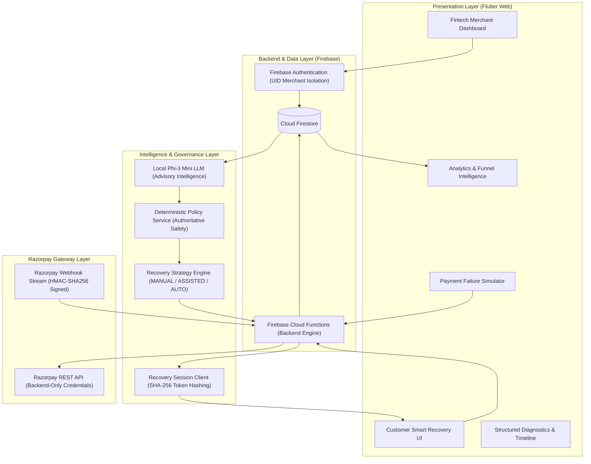
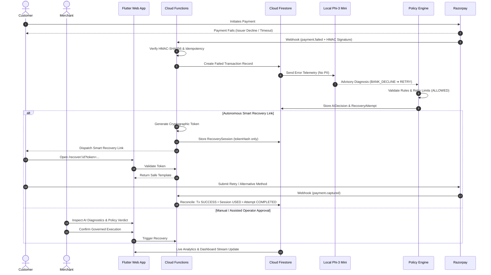

# REVIVE — Autonomous AI Payment Recovery Platform

> **Governed Payment Failure Intelligence & Smart Recovery for Modern Digital Merchants**

REVIVE is an intelligent, policy-governed payment recovery platform built for the **Razorpay Buildathon**. It transforms failed digital transactions from revenue loss into successful recoveries by combining **local AI failure intelligence** with **deterministic safety policy enforcement**, **cryptographic customer recovery sessions**, and **authoritative Razorpay webhook reconciliation**.

---

## 1. Project Overview

### The Problem
When a digital payment fails in an online checkout or subscription flow, most payment systems treat the failure as terminal. The user sees a generic decline message, the merchant loses revenue, and customer conversion drops. 

Traditional automated retry mechanisms fail because:
1. **Blind Retries Cause Harm**: Retrying an invalid card or insufficient funds payment wastes gateway fees and risks fraud penalties.
2. **Unchecked AI Execution Is Dangerous**: LLMs hallucinate and must never be given unrestricted authority to initiate financial debits or manipulate transactions.
3. **Customer Friction**: Customers are rarely provided contextual, frictionless alternative payment links to salvage their transaction.

### How REVIVE Solves It
REVIVE bridges the gap between payment failure telemetry and successful settlement through a structured, multi-layer recovery pipeline:
* **Ingests & Normalizes** granular Razorpay failure taxonomy (`errorCode`, `errorReason`, `errorSource`, `errorStep`).
* **Classifies Root Causes** using a private, local **Phi-3 Mini** LLM to diagnose transient vs. structural payment disruptions.
* **Enforces Deterministic Policies** through a strict rule engine that governs retry eligibility, rate limits, and risk thresholds.
* **Executes Governed Recovery** via assisted operator approvals, automated retries, or secure, expiring customer recovery links.
* **Reconciles Authoritatively** via Razorpay HMAC-SHA256 verified webhooks.

### Core Architectural Mantra

```text
AI Recommends (Advisory) ➔ Policy Engine Decides (Enforced) ➔ Backend Executes (Governed) ➔ Razorpay Webhook Reconciles (Authoritative)
```

### Technology Stack
* **Frontend**: Flutter Web (Dart 3.x, Responsive Material 3 Fintech UI)
* **Backend**: Firebase Cloud Functions (Node.js 18/20, Express, HMAC-SHA256)
* **Data & Auth**: Cloud Firestore & Firebase Authentication (Merchant UID Scoped)
* **Payment Gateway**: Razorpay REST API & Webhooks
* **AI Engine**: `Local Phi-3 Mini (buildathon) → specialized payment-failure model (production direction)`

---

# REVIVE vs Existing Payment Failure Systems

A clear, technically accurate comparison between conventional payment-failure handling and REVIVE:

| Capability | Existing Payment Systems | REVIVE |
| :--- | :--- | :--- |
| Payment failure detection | Detects and reports failed transactions | Captures detailed Razorpay failure telemetry |
| Failure understanding | Generic failure status/reason | Classifies failures into structured categories such as `BANK_DECLINE`, `NETWORK_ERROR`, `INSUFFICIENT_FUNDS`, `INVALID_DETAILS`, `AUTHENTICATION_FAILURE` and `FRAUD_RISK` |
| AI failure intelligence | Usually limited to reporting/analytics | Local AI analyzes failure telemetry and provides an advisory classification/recommendation |
| Recovery decision | Often application-specific/static retry logic | AI recommendation → deterministic policy engine → governed recovery decision |
| Risk controls | Gateway/application dependent | Explicit fraud blocking, retry limits, merchant policies and autonomy modes |
| Merchant control | Configuration-focused | `MANUAL` / `ASSISTED` / `AUTONOMOUS` recovery governance |
| Recovery execution | Retry may be implemented as application logic | Backend-controlled execution with confirmation and safety guards |
| Customer recovery | Usually customer retries manually | Generates secure, single-use recovery sessions/links for guided recovery |
| Recovery simulation | Usually not available as an end-to-end feature | Full payment-failure simulator reproduces the recovery pipeline without touching live payments |
| Failure analytics | Basic transaction reporting | Failure categories, banks, payment methods, recovery funnel, strategy performance and recovery trends |
| Auditability | Transaction logs | AI decision, policy decision, recovery attempt, execution and audit trail |
| Idempotency | Depends on implementation | Webhook and recovery execution idempotency protections |
| Payment reconciliation | Gateway status | Razorpay webhook remains authoritative for final payment reconciliation |
| AI feedback loop | Usually not part of the recovery workflow | Recovery outcomes can become feedback data for future model training/evaluation |

## What Makes REVIVE Different?

REVIVE's architectural differentiation spans four core layers:

### 1. From Failure Detection → Failure Intelligence

Traditional systems can tell a merchant:

```text
Payment Failed
```

REVIVE preserves the structured payment failure taxonomy:

```text
BANK_DECLINE
NETWORK_ERROR
INSUFFICIENT_FUNDS
INVALID_DETAILS
AUTHENTICATION_FAILURE
FRAUD_RISK
UNKNOWN
```

The AI layer interprets this telemetry and produces an advisory recommendation.

### 2. From AI Recommendation → Governed Decision

REVIVE does not allow the AI model to execute payments.

```text
AI proposes
    ↓
Policy validates
    ↓
Backend executes
    ↓
Webhook confirms
```

This strict separation prevents an LLM from becoming the authority over financial actions.

### 3. From Retry → Recovery

REVIVE treats recovery as a complete lifecycle rather than simply retrying a failed payment:

```text
Failed Payment
      ↓
Failure Intelligence
      ↓
Policy Evaluation
      ↓
Recovery Strategy
      ↓
Recovery Attempt
      ↓
Customer Recovery
      ↓
Payment Outcome
      ↓
Webhook Reconciliation
      ↓
Analytics
```

This represents REVIVE's core product loop.

### 4. From Static Rules → Adaptive Intelligence

The current buildathon implementation uses a locally hosted Phi-3 Mini model.

The production direction is:

```text
Historical Payment Data
        ↓
Failure / Recovery Outcomes
        ↓
Training Dataset
        ↓
Payment-Failure-Specialized Model
        ↓
Live Failure Classification
        ↓
Recovery Outcome
        ↓
New Training Signal
        ↓
Periodic Model Evaluation / Retraining
```

> Every transaction can contribute an outcome signal to the historical dataset. The specialized model can then be periodically evaluated and retrained/fine-tuned using accumulated, authorized and appropriately de-identified data.

## REVIVE's Core Differentiator

```text
EXISTING

Payment Failed
      ↓
Show Error
      ↓
Customer Retries
```

versus:

```text
REVIVE

Payment Failed
      ↓
Understand Why
      ↓
AI Failure Intelligence
      ↓
Policy & Risk Evaluation
      ↓
Choose Recovery Strategy
      ↓
Governed Execution
      ↓
Customer Recovery
      ↓
Verify Outcome
      ↓
Learn From Outcome
```

> REVIVE is not another payment gateway. It is an intelligent payment-recovery orchestration layer that sits on top of payment infrastructure, converts granular payment failures into actionable intelligence, applies deterministic safety policies, and guides eligible failed payments through governed recovery.

## Why This Matters

* **Reduce avoidable payment abandonment.**
* **Give merchants visibility into *why* payments fail.**
* **Select recovery strategies based on failure context instead of blindly retrying.**
* **Provide customer-friendly recovery journeys.**
* **Prevent unsafe automated actions through deterministic policy controls.**
* **Measure which recovery strategies actually work.**
* **Build a feedback dataset for future payment-failure model improvement.**

---

## 2. System Architecture



### Architectural Separation of Concerns
1. **Presentation Layer**: Responsive Flutter Web dashboard, simulator, and customer-facing recovery views. Contains **zero secrets**.
2. **Backend & Functions Layer**: Node.js Firebase Cloud Functions enforcing authentication, webhook signature validation, idempotency, and Razorpay API communication.
3. **Local AI Layer**: Local Phi-3 Mini model providing advisory diagnostics without direct payment execution privileges.
4. **Deterministic Policy Layer**: Pure rule engine enforcing hard boundaries (fraud blocking, max retry limits, merchant autonomy modes).
5. **Gateway Layer**: Razorpay REST API and Webhooks acting as the single source of truth for payment settlement.
6. **Analytics Layer**: Real-time deterministic aggregation computing recovery yields, failure distributions, and conversion funnels.

---

## 3. Layer-by-Layer Architecture

### Layer 1 — Presentation Layer (Flutter Web)
Built with Flutter Web for cross-platform fintech performance.
* **Merchant Dashboard**: Razorpay-inspired dense layout with dynamic KPIs, issuing bank telemetry, and real-time transaction streams.
* **Recovery Simulator Screen**: Interactive failure sandbox to demonstrate the 7-step pipeline across 7 failure scenarios.
* **Customer Recovery UI**: Responsive `/recover/:id?token=...` interface offering seamless retry or alternative payment methods.
* **Zero-Secret Guarantee**: The Flutter client never holds Razorpay Key Secrets, Firebase Admin credentials, or sensitive banking tokens.

### Layer 2 — Authentication & Multi-Merchant Isolation
* Uses **Firebase Authentication** (Email/Password & OAuth).
* Merchant identity is anchored to `user.uid`.
* All database collections enforce merchant scoping:
  ```text
  merchants/{merchantId}
  transactions (where merchantId == auth.uid)
  recovery_attempts (where merchantId == auth.uid)
  recovery_sessions (where merchantId == auth.uid)
  ai_decisions (where merchantId == auth.uid)
  ```
* Cross-tenant data leakage is strictly prevented by Firestore Security Rules and backend function validation.

### Layer 3 — Data Layer (Cloud Firestore)
The database schema models the entire lifecycle of a transaction and its recovery:

| Collection | Description | Key Fields |
| :--- | :--- | :--- |
| `merchants` | Merchant profile and autonomy configuration | `id`, `name`, `email`, `autonomyMode`, `policyConfig` |
| `transactions` | Normalized payment telemetry & recovery status | `id`, `merchantId`, `amount`, `status`, `bank`, `paymentMethod`, `errorCode`, `errorReason`, `errorSource`, `errorStep`, `isRecovered`, `simulated` |
| `customers` | Customer entity records | `id`, `merchantId`, `name`, `email`, `phone` |
| `ai_decisions` | Advisory classification records with attribution | `id`, `transactionId`, `merchantId`, `failureCategory`, `recommendedStrategy`, `confidence`, `modelName`, `promptVersion` |
| `recovery_attempts` | Governed execution records | `id`, `transactionId`, `merchantId`, `strategy`, `status`, `policyStatus`, `attemptNumber`, `executionMode` |
| `recovery_sessions` | Cryptographically secured customer recovery sessions | `id`, `transactionId`, `merchantId`, `tokenHash`, `strategy`, `status`, `expiresAt` |
| `merchant_policies` | Custom rules and autonomy overrides | `id`, `merchantId`, `maxAutomaticRetries`, `allowCardRetries`, `fraudBlockEnabled` |
| `bank_health` | Issuer uptime telemetry | `id`, `bank`, `method`, `status`, `successRate` |
| `audit_logs` | Immutable audit trail of all actions | `id`, `merchantId`, `action`, `entityId`, `details`, `timestamp` |
| `processed_events` | Webhook idempotency ledger | `id` (Razorpay Event ID), `processedAt` |
| `processed_recoveries` | Recovery execution idempotency records | `id` (Attempt Hash), `executedAt`, `result` |

#### Transaction Failure Taxonomy Schema
```json
{
  "id": "tx_rzp_984210",
  "merchantId": "merchant_xyz123",
  "amount": 2450.00,
  "currency": "INR",
  "status": "FAILED",
  "paymentMethod": "UPI",
  "bank": "HDFC",
  "errorCode": "BAD_REQUEST_ERROR",
  "errorReason": "Payment declined by bank due to technical disruption",
  "errorSource": "bank",
  "errorStep": "payment_authorization",
  "simulated": false,
  "createdAt": "2026-09-04T00:30:00.000Z"
}
```

---

## 4. Razorpay Integration Layer

```text
Flutter App ──(HTTPS)──> Firebase Cloud Function ──(API Secret)──> Razorpay REST API
                                 ▲
                                 │ (HMAC-SHA256 Signature Verified)
Razorpay Webhook Stream ─────────┘
```

* **Backend-Only Secret Handling**: Razorpay `RAZORPAY_KEY_ID` and `RAZORPAY_KEY_SECRET` reside exclusively in Cloud Function environment secrets.
* **HMAC-SHA256 Signature Verification**: Every incoming webhook payload is validated against `RAZORPAY_WEBHOOK_SECRET` before processing. Tampered payloads are rejected immediately.
* **Idempotent Webhook Processing**: Webhook event IDs are written to `processed_events`. Duplicate deliveries are safely acknowledged without duplicate state transitions.
* **Reconciliation Authority**: Razorpay webhooks remain the sole authoritative source for final payment status (`payment.captured` ➔ `SUCCESS`/`RECOVERED`).

---

## 5. AI Failure Intelligence Layer

REVIVE runs a local **Phi-3 Mini 4K Instruct Q4 GGUF** model via `llama-server` during development:

```text
Endpoint: http://127.0.0.1:8080/v1/chat/completions
Prompt Template: revive-payment-classifier-v1
Sampling: temperature = 0.0 (Deterministic)
```

### Supported Failure Categories
1. `BANK_DECLINE` — Core issuer processing rejections or card limit declines.
2. `NETWORK_ERROR` — Gateway timeouts, network drops, or socket disconnects.
3. `INSUFFICIENT_FUNDS` — Payer account balance insufficiencies.
4. `INVALID_DETAILS` — Incorrect card numbers, expired CVVs, or malformed VPAs.
5. `AUTHENTICATION_FAILURE` — OTP timeouts, 3DS 2FA failures, or MPIN aborts.
6. `FRAUD_RISK` — Velocity anomalies or gateway risk engine flags.
7. `UNKNOWN` — Unclassified anomalous payment disruptions.

### Supported Advisory Strategies
* `RETRY` — Immediate or short-delay re-attempt.
* `WAIT_AND_RETRY` — Exponential backoff retry for degraded banking networks.
* `ALTERNATIVE_METHOD` — Fallback payment instrument (e.g., UPI when Card fails).
* `NO_ACTION` — Suppress retry (required for fraud risk or invalid details).
* `ESCALATE` — Route to merchant operator review.

> **Advisory Invariant**: The AI is strictly advisory. It cannot alter transaction state or execute charges directly. Every AI decision is saved with full prompt and model version attribution for auditing.

---

## 6. AI Model Architecture & Continuous Learning

### Current AI Model
* REVIVE currently runs **Phi-3 Mini locally** through an OpenAI-compatible local inference server.
* The Flutter application communicates with the local model through the existing `AIService` / `LocalLLMService` abstraction layer.
* The current development endpoint is:
  ```text
  http://127.0.0.1:8080/v1/chat/completions
  ```
* The model is strictly utilized for **payment-failure classification and recovery recommendations**.
* The AI receives sanitized, structured payment telemetry:
  * `paymentMethod` (UPI, Card, Netbanking)
  * `bank` (HDFC, ICICI, SBI, AXIS, etc.)
  * `amount` (Numeric value in INR)
  * `errorCode` (Razorpay normalized code)
  * `errorReason` (Gateway error message)
  * `errorSource` (bank, gateway, customer)
  * `errorStep` (payment_authorization, authentication, etc.)
* **Privacy & Security Guard**: Never send Razorpay secrets, authentication tokens, API keys, or customer PII to the model.

### AI Decision Pipeline

```text
Razorpay Webhook
       ↓
Transaction Telemetry
       ↓
Payment Failure Classification
       ↓
Local Phi-3 Mini
       ↓
AI Recommendation
       ↓
Deterministic Recovery Policy Engine
       ↓
Governed Recovery Decision
       ↓
Recovery Execution
       ↓
Actual Payment Outcome
```

**The AI is advisory only.** The AI model must **NEVER** directly execute a payment recovery.

The deterministic policy engine remains the final authority and applies:
* Fraud-risk blocking
* Retry limits & exponential backoff rules
* Merchant policy configurations
* Autonomy mode enforcement (`MANUAL`, `ASSISTED`, `AUTONOMOUS`)
* Operator manual confirmation requirements
* Recovery session eligibility rules

---

### Specialized Payment-Failure Model — Production Direction

> *The buildathon prototype uses Phi-3 Mini as the local inference model. The production architecture is model-agnostic and is designed to support a specialized payment-failure model trained on historical transaction telemetry and recovery outcomes.*

Rather than relying on unguided dynamic weight changes during live transactions, REVIVE employs a controlled, periodic feedback loop:

```text
Historical Transactions
        ↓
Failure / Recovery Dataset
        ↓
Model Training / Fine-tuning
        ↓
Payment-Failure Model
        ↓
Live Transaction Classification
        ↓
Recovery Outcome
        ↓
New Training Data
        ↓
Periodic Model Retraining
```

Every transaction contributes verified **feedback and outcome data** (reconciled by webhooks) to the historical dataset, while model updates happen through a controlled, benchmarked training/fine-tuning pipeline rather than automatically changing model weights after every transaction.

---

### Model Improvement Loop
The continuous improvement loop ingests structured training signals:
* Failure category & sub-category
* Razorpay granular error taxonomy (`errorCode`, `errorReason`, `errorSource`, `errorStep`)
* Issuing bank & network health telemetry
* Payment method & instrument characteristics
* Transaction size & velocity profiles
* AI recommendation vs. Deterministic Policy verdict
* Executed recovery strategy (`RETRY`, `WAIT_AND_RETRY`, `ALTERNATIVE_METHOD`)
* Final payment outcome (`RECOVERED` vs. `TERMINAL_FAILURE`)
* Time-to-recovery duration
* Multi-attempt retry success/failure ratios

This comprehensive feedback enables the model to improve failure classification accuracy and precision in recovery strategy recommendations over time.

---

### Model Replacement Architecture
The AI layer is intentionally decoupled via clean interfaces:

```text
AIService
   │
   ├── LocalLLMService
   │       └── Phi-3 Mini        ← Current buildathon model
   │
   └── PaymentFailureModel
           └── Specialized model ← Production direction
```

Because the application interacts with `AIService`, the rest of REVIVE does not depend directly on a specific LLM. The underlying model can be swapped with a specialized fine-tuned model or dedicated inference endpoint without modifying the recovery strategy engine, Firestore data layer, Razorpay webhook pipeline, or merchant dashboard.

---

### Safety & Governance

> **AI proposes. Policy decides. Backend executes.**

REVIVE adheres to 9 strict safety invariants:
1. **Zero Secret Exposure**: AI never receives Razorpay secret credentials or private keys.
2. **No Direct Execution**: AI never directly initiates or executes payment charges.
3. **Deterministic Validation**: AI recommendations are unconditionally validated by deterministic policy rules.
4. **Fraud Risk Quarantine**: Fraud-risk scenarios are permanently blocked from automated recovery.
5. **Merchant Autonomy Control**: Merchant configuration dictates whether actions require manual, assisted, or autonomous dispatch.
6. **Backend Execution**: Recovery execution occurs exclusively through authenticated backend functions.
7. **Authoritative Webhooks**: Razorpay webhooks remain the sole source of truth for payment status.
8. **Anonymized Data**: Model training uses strictly authorized, anonymized, and de-identified transaction records.
9. **Deliberate Deployment**: Production model updates are versioned, regression-tested against benchmarks, and deployed deliberately.

---

## 7. Deterministic Policy Layer

The `RecoveryPolicyService` serves as the authoritative safety gateway between AI suggestions and execution.

```text
AI Classification ──> [ Deterministic Policy Engine ] ──> Outcome: ALLOWED | BLOCKED | REQUIRES_REVIEW
```

### Enforced Guardrails
* **Fraud Prevention**: Any transaction flagged as `FRAUD_RISK` is unconditionally `BLOCKED`.
* **Invalid Details Protection**: Payments failing due to `INVALID_DETAILS` are blocked from automated retries and directed to customer link updates.
* **Retry Rate Limiting**: Enforces strict merchant-configured `maxAutomaticRetries` (default: 2) to protect customer trust and avoid gateway penalties.
* **Authentication Safeguards**: Auth failures require operator confirmation when configured under merchant policy.
* **Anomaly Escalation**: Unrecognized codes escalate to `REQUIRES_REVIEW`.

---

## 8. Recovery Strategy Engine

The strategy engine evaluates the transaction context, AI diagnostic, policy verdict, and previous attempts to determine the exact recovery plan.

### Merchant Autonomy Modes
* **`MANUAL`**: AI recommends diagnostics; operator decides and initiates all recovery actions.
* **`ASSISTED`**: Deterministic policy pre-approves safe actions; operator clicks confirmation in the dashboard.
* **`AUTONOMOUS`**: Deterministic policy pre-approves safe actions; backend orchestrates automated retry or customer link dispatch.

---

## 9. Recovery Execution Layer & Simulator Safety

* **Execution Guards**: Validates merchant ownership, non-terminal attempt status, and strategy permissions before execution.
* **Idempotency**: Attempt IDs are checked against `processed_recoveries` to prevent duplicate billing.
* **Dual Execution Modes**:
  * **Simulation Mode**: Executes full lifecycle telemetry and audit logging without contacting Razorpay.
  * **Live Execution**: Dispatches real backend API calls.
* **Safety Invariant**: Simulated completions are rejected on live production records (`simulated === true` strictly enforced).

---

## 10. Customer Recovery Layer (Smart Recovery Links)

When automated retry is unavailable (e.g. insufficient funds, card expired, auth decline), REVIVE generates single-use **Customer Recovery Sessions**:

```text
Failed Payment ➔ Create Session ➔ Generate SHA-256 Token ➔ Secure Link (/recover/:id?token=...)
```

* **Cryptographic Security**: Raw tokens are never persisted in Firestore; only deterministic SHA-256 hashes (`tokenHash`) are stored.
* **Ephemerality**: Sessions expire automatically after 30 minutes.
* **Single-Use**: Once a payment is reconciled, the session transitions to `USED` and cannot be replayed.
* **Deterministic UI**: Renders customer-friendly, brand-safe recovery templates with dynamic UPI/Card fallback actions.

---

## 11. Recovery Simulator & Demo Engine

REVIVE includes an end-to-end **Payment Failure Simulator** to test and demonstrate all 10 phases without relying on live bank outages.

### 7 Realistic Scenario Presets
1. **Bank Decline** (`HDFC` • `UPI` • `BAD_REQUEST_ERROR` • ₹1,250) ➔ AI: `BANK_DECLINE` ➔ Strategy: `RETRY` (ALLOWED)
2. **Network Timeout** (`ICICI` • `UPI` • `GATEWAY_TIMEOUT` • ₹850) ➔ AI: `NETWORK_ERROR` ➔ Strategy: `RETRY` (ALLOWED)
3. **Insufficient Funds** (`SBI` • `UPI` • `INSUFFICIENT_FUNDS` • ₹3,200) ➔ AI: `INSUFFICIENT_FUNDS` ➔ Strategy: `ALTERNATIVE_METHOD`
4. **Invalid Details** (`AXIS` • `CARD` • `BAD_REQUEST_CARD_INVALID` • ₹2,100) ➔ AI: `INVALID_DETAILS` ➔ Strategy: `ALTERNATIVE_METHOD`
5. **2FA Auth Failure** (`KOTAK` • `NETBANKING` • `AUTH_FAILED_OTP` • ₹1,750) ➔ AI: `AUTHENTICATION_FAILURE` ➔ Strategy: `RETRY`
6. **Fraud Risk Filter** (`HDFC` • `CARD` • `RISK_SUSPECTED_FRAUD` • ₹45,000) ➔ AI: `FRAUD_RISK` ➔ Strategy: `NO_ACTION` (BLOCKED)
7. **Unknown Anomaly** (`UNKNOWN` • `UPI` • `UNKNOWN_DISRUPTION` • ₹999) ➔ AI: `UNKNOWN` ➔ Strategy: `ESCALATE` (REQUIRES_REVIEW)

---

## 12. Analytics & Recovery Intelligence

The analytics engine deterministically calculates real-time performance indicators without relying on LLM arithmetic:

* **Top KPIs**: Total Payment Volume, Failed Payments (count & value), Recovered Payments (count & value), Net Recovery Rate (%).
* **Payment Failure Breakdown**: Category-wise distribution bars with percentages and revenue impact.
* **7-Day Recovery Trend**: Daily time series chart comparing Failed vs. Recovered transaction volumes.
* **Bank Failure Distribution**: Issuer network telemetry (HDFC, ICICI, SBI, AXIS, Kotak).
* **Payment Instrument Shares**: Telemetry across UPI, Credit/Debit Cards, and Netbanking.
* **Strategy Win Rates**: Quantitative performance per strategy (`RETRY`, `WAIT_AND_RETRY`, `ALTERNATIVE_METHOD`, `ESCALATE`).
* **5-Stage Recovery Conversion Funnel**:
  ```text
  Failed Payments (100%) ➔ AI Classified ➔ Recovery Eligible ➔ Recovery Attempted ➔ Recovered & Reconciled
  ```

---

## 13. Security Architecture

```text
┌──────────────────────────────────────────────────────────┐
│                    REVIVE SECURITY MATRIX                │
├─────────────────────────┬────────────────────────────────┤
│ Secret Exposure         │ Zero secrets in Flutter/Git    │
│ Authentication          │ Merchant-scoped Firebase Auth  │
│ Database Rules          │ Strict merchantId isolation    │
│ Webhook Security        │ HMAC-SHA256 signature verified │
│ Idempotency             │ Double-spend & replay immune   │
│ Recovery Links          │ Cryptographic SHA-256 hashed   │
│ AI Privacy              │ Zero PII / API keys in prompts │
│ Execution Guard         │ Policy overrides AI output     │
└─────────────────────────┴────────────────────────────────┘
```

---

## 14. Complete End-to-End Recovery Sequence



---

## 15. Project Structure

```text
revive/
├── .env.example                     # Environment template (secrets ignored)
├── firebase.json                    # Firebase hosting, firestore, functions config
├── firestore.rules                  # Merchant-isolated security rules
├── functions/                       # Firebase Cloud Functions (Node.js)
│   ├── index.js                     # Exported HTTPS callable & webhook functions
│   ├── services/
│   │   ├── razorpay_service.js      # HMAC-SHA256 signature & error taxonomy
│   │   ├── recovery_executor.js     # Governed execution & backend guards
│   │   ├── recovery_session_service.js # SHA-256 token session management
│   │   └── simulator_service.js     # Safe demo engine & reconciliation
│   └── test/
│       ├── razorpay_service.test.js # Webhook & taxonomy tests
│       ├── recovery_executor.test.js# Guard & idempotency tests
│       ├── recovery_session.test.js # Token hashing & lifecycle tests
│       └── simulator.test.js        # Simulation scenario tests
├── lib/                             # Flutter Application Root
│   ├── app/
│   │   └── routes.dart              # Named route definitions
│   ├── features/
│   │   ├── auth/                    # Merchant Sign In & Sign Up
│   │   ├── dashboard/               # Main Razorpay-style fintech dashboard
│   │   ├── recovery/                # Customer smart recovery page
│   │   └── simulator/               # Interactive recovery demo screen
│   ├── models/                      # Strongly typed data models
│   │   ├── ai_decision.dart         # AI diagnostic & prompt attribution
│   │   ├── analytics_summary.dart   # Top-level KPI aggregations
│   │   ├── failure_analytics.dart   # Category, bank, and method analytics
│   │   ├── merchant.dart            # Merchant entity & autonomy mode
│   │   ├── recovery_analytics.dart  # Time-series & 5-stage funnel models
│   │   ├── recovery_attempt.dart    # Recovery attempt record
│   │   ├── recovery_session.dart    # Single-use hashed session model
│   │   ├── simulation_scenario.dart # 7 standard failure presets
│   │   ├── strategy_analytics.dart  # Strategy win rate model
│   │   └── transaction.dart         # Normalized transaction schema
│   ├── repositories/                # Firestore data access layer
│   │   ├── ai_decision_repository.dart
│   │   ├── analytics_repository.dart
│   │   ├── merchant_repository.dart
│   │   ├── recovery_attempt_repository.dart
│   │   └── transaction_repository.dart
│   ├── services/                    # Business logic & local AI
│   │   ├── ai_service.dart          # Local Phi-3 Mini integration & fallback
│   │   ├── analytics_service.dart   # Deterministic mathematical calculations
│   │   ├── auth_service.dart        # Firebase Auth wrapper
│   │   ├── payment_simulator_service.dart # 7-step simulator orchestrator
│   │   ├── recovery_policy_service.dart   # Deterministic safety rule engine
│   │   ├── recovery_session_client.dart   # Customer session client
│   │   └── recovery_strategy_service.dart # Autonomy mode & strategy selector
│   └── widgets/                     # Reusable UI components
│       ├── ai_intelligence_card.dart
│       ├── bank_failure_card.dart
│       ├── dashboard_sidebar.dart
│       ├── failure_analytics_card.dart
│       ├── metric_card.dart
│       ├── payment_method_card.dart
│       ├── razorpay_connection_card.dart
│       ├── recovery_funnel_card.dart
│       ├── recovery_strategy_card.dart
│       ├── recovery_trend_card.dart
│       └── strategy_performance_card.dart
└── test/                            # Flutter Unit & Widget Test Suites
    ├── ai_intelligence_test.dart    # AI classification & fallback tests
    ├── analytics_test.dart          # Deterministic analytics & card tests
    ├── customer_recovery_test.dart  # Customer recovery UI tests
    ├── models_test.dart             # Model serialization tests
    ├── payment_simulator_test.dart  # Simulation pipeline tests
    ├── recovery_execution_test.dart # Execution guard & confirmation tests
    ├── recovery_strategy_test.dart  # Policy engine & autonomy tests
    └── widgets_test.dart            # UI widget & navigation tests
```

---

## 16. Local Development Setup

### Prerequisites
* Flutter SDK (3.24.0 or later)
* Node.js (18.x or 20.x)
* Firebase CLI
* Local `llama-server` or compatible OpenAI-compatible LLM endpoint

### 1. Clone & Install Dependencies
```bash
git clone https://github.com/shlok6097/revive.git
cd revive

# Flutter dependencies
flutter pub get

# Cloud Functions dependencies
cd functions
npm install
cd ..
```

### 2. Local AI Setup (Phi-3 Mini)
Start your local LLM server using `llama.cpp`:
```bash
llama-server -m phi-3-mini-4k-instruct-q4.gguf --port 8080 -c 4096
```
The model will be accessible locally at `http://127.0.0.1:8080/v1/chat/completions`.

### 3. Run Flutter Application
```bash
flutter run -d chrome
```

---

## 17. Cloud Functions & Backend Verification

Run the comprehensive backend test suite:
```bash
cd functions
npm test
```

---

## 18. Automated Verification Results (Phase 10)

```text
============================================================
✓ Flutter Unit & Widget Tests    : 84 / 84 Passed (0 Failed)
✓ Backend Node.js Tests          : 26 / 26 Passed (0 Failed)
✓ Total Automated Tests          : 110 Passed
✓ Flutter Static Analysis        : 0 Issues Found
✓ Flutter Web Production Build   : Success (build/web)
✓ Firestore Security Rules       : Validated (Merchant Isolated)
✓ Security Audit                 : 0 Secrets Detected
============================================================
```

---

## 19. AI Testing & Diagnostics

The local AI failure classifier receives normalized telemetry and responds with strictly typed JSON.

### Sample Inference Payload
```json
{
  "model": "Phi-3-mini-4k-instruct-q4",
  "temperature": 0.0,
  "messages": [
    {
      "role": "system",
      "content": "You are REVIVE Payment Failure Intelligence. Return valid JSON only."
    },
    {
      "role": "user",
      "content": "Analyze failure: Bank: HDFC, Method: UPI, Code: BAD_REQUEST_ERROR, Reason: Payment declined by bank"
    }
  ]
}
```

### Structured Diagnostic Output
```json
{
  "failureCategory": "BANK_DECLINE",
  "confidenceScore": 0.94,
  "recommendedStrategy": "RETRY",
  "reasoning": "Transient issuer decline on UPI network. Safe to retry after brief interval."
}
```

---

## 20. Core Design Principles

1. **AI is Advisory**: Machine learning provides failure diagnosis; it never holds payment execution authority.
2. **Deterministic Policy Rules**: Risky, fraudulent, or malformed transactions are stopped by hard-coded safety logic.
3. **Secrets Never Reach the Client**: Razorpay secrets and private keys stay strictly within backend environments.
4. **Webhooks are Authoritative**: Payment resolution is only recognized after cryptographic webhook verification.
5. **Full Auditability**: Every decision, attempt, and token generation is recorded in an immutable audit ledger.
6. **Idempotent Operations**: All execution paths protect against duplicate execution and race conditions.
7. **Strict Multi-Tenant Isolation**: Merchant records are fully isolated by Firebase Auth UID.
8. **Simulation Guardrails**: Demo simulations can never interact with or modify live production transactions.
9. **Controlled Customer Messaging**: Payer-facing notifications use deterministic, brand-safe templates.
10. **Attribution Transparency**: Every AI diagnostic records the exact model version and prompt identifier.

---

## 21.Why REVIVE?

Payment failures in digital commerce are treated as binary dead-ends. When a transaction fails, merchants lose hard-won revenue, and customers face frustrating checkout interruptions.

**REVIVE turns failure into recovery.**

Rather than naively retrying payments or relying on unconstrained AI agents, REVIVE introduces a **governed recovery pipeline**:
1. **AI provides intelligence** by diagnosing the root cause of payment disruptions.
2. **Deterministic policy provides control** by enforcing safety limits and fraud blocks.
3. **Smart sessions provide recovery paths** by delivering seamless customer recovery links.
4. **Razorpay provides authoritative confirmation** through cryptographic webhook reconciliation.

> *REVIVE is not an AI that blindly retries payments. It is a governed payment recovery platform where AI provides intelligence, policy provides safety, and Razorpay provides authoritative payment reconciliation.*
